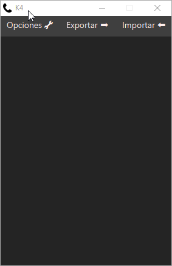

# INDEX 📋

* **Contacts**  
  + [**About project**](#about-project) ⭐
  + [**Preview**](#preview) 🔍
  + [**Screenshots**](#screenshots) 📷
  + [**Technologies**](#technologies) 💻
  + [**Setup**](#setup) 🔧
  + [**Usage**](#usage) 📋
  + [**Status**](#status) ⚪
  + [**Contact**](#contact) 📞

# About project⭐

**Date**: January-June, 2019.   
**Duration**: 1 Month.

This project was developted in order to practice with **Java** and **JavaFX**.

There are **2** versions of this project.

**Version 1:** Displaying by console, basic version.

**Version 2:** Displaying by JavaFX, graphic version. This version is the last one.

# Preview🔍

[💠You can try it!💠](https://github.com/Hukex/Contacts/blob/master/dist/K4FernandoVera.jar?raw=true)


# Screenshots📷


>
>
>
>
 
# Technologies💻

* **JAVA**
* **JAVA FX**
* **NetBeans 8.2**

# Setup🔧

If you want only to play just go to preview and click on "You can try it!" download the .jar file and if you have java installed it will run with double click.

In case you want to edit it, well in my case I used NetBeans 8.2 so install it and you will be able to open it without any problem. Remember to clone the project to avoid issues with the project.

``` bash
git clone https://github.com/Hukex/Contacts.git
```

# Usage📋

Its a contacts book app just enjoy it.

# Status⚪

**Finished.**

It was for practice so it's done.

# Contact📞

My name is [Fernando](https://www.linkedin.com/in/fevm/), you can contact me if you desire!

## 😃 Thanks for reading. 👋
